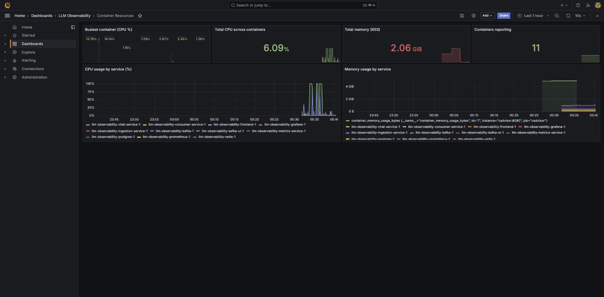
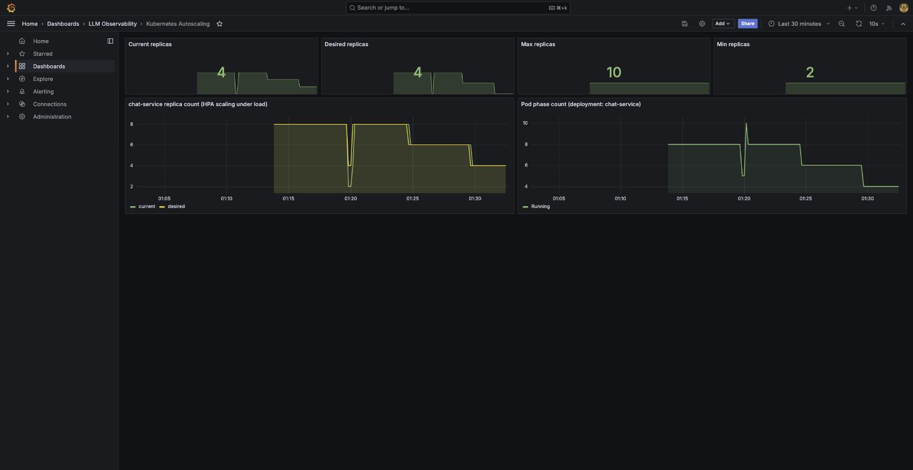

# Load Testing: Methodology, Findings, and the Kubernetes Autoscaling Demo

This documents a load-testing session against the local stack: what was
tested, what broke, why, what was fixed, and a live proof that the
Kubernetes HPA (`infra/k8s/21-chat-service.yaml`) actually scales
chat-service under load. See [WALKTHROUGH.md](WALKTHROUGH.md) for the
screen-by-screen tour and [ARCHITECTURE.md](ARCHITECTURE.md) for the system
design.

## Test machine

| | |
|---|---|
| Host | macOS, 24GB RAM, 10 CPU cores |
| Docker Desktop VM | **7.65GB / 10 cores** — the actual ceiling for every container in this document, not the host's 24GB |
| Host free RAM during testing | Consistently tight (~250MB–1GB free) — other applications were already using most of the 24GB |

This matters for interpreting every result below: **the host's 24GB was
never the binding constraint.** Docker Desktop's VM allocation (7.65GB) and,
far more often, a single process's CPU ceiling were hit long before RAM
was.

## The `/chat/dummy` endpoint

Real load testing against `/chat` (which calls out to a live LLM provider)
is bounded by *provider* rate limits, not this platform's own capacity —
see [Finding 1](#finding-1-groq-rate-limiting-looked-like-app-failure)
below. To isolate the platform's own concurrency ceiling,
`apps/chat-service/app/api/routes_chat.py` adds:

```
POST /chat/dummy
```

Sleeps 10ms and returns canned data — no LLM call, no database write, no
Kafka publish. It exists purely so load tests measure the ASGI/HTTP layer's
own capacity, unconfounded by provider limits, DB round-trips, or Kafka
backpressure. Driven by `load-tests/k6/dummy.js`
(`./load-tests/run.sh` doesn't cover it — run directly, e.g.
`k6 run -e VUS=1500 -e DURATION=25s load-tests/k6/dummy.js`).

---

## Finding 1: Groq rate-limiting looked like app failure

**Symptom:** a `chat` smoke test (5 VUs, real Groq calls) showed a 55.93%
error rate — `litellm.Timeout: ... time taken=0.0 seconds`.

**Root cause:** Groq's free-tier per-minute request quota, not the app.
Proven by firing N truly-simultaneous `curl` requests directly:

| Concurrency | Result |
|---|---|
| 2 | all succeed |
| 3 | all succeed |
| 4 | all succeed |
| 5 (right after the failing k6 run) | all timed out instantly |
| 5 (retried a few seconds later) | all succeed |

The failures tracked the *cumulative* request volume in a short window
(k6's 118 requests over 80s), not instantaneous concurrency — a rate-limit
signature, not a capacity one. litellm mislabels Groq's throttling response
as a generic `Timeout` rather than a rate-limit error, which is what made
it initially look like an app bug.

**Takeaway:** use `/chat/dummy` (or a paid provider key) for concurrency
testing; `/chat` concurrency is bounded by whatever your provider's plan
allows, not by this codebase.

## Finding 2: a single chat-service instance caps at ~2,000 req/s

Using `/chat/dummy` against the Docker Compose stack (a single
chat-service container, one uvicorn worker process — no `--workers` flag
in `apps/chat-service/Dockerfile`):

| VUs | Throughput | Error rate | p95 latency |
|---|---|---|---|
| 500 | 2,488 req/s | 0.00% | 258ms |
| 1,500 | ~2,000–2,050 req/s | 2.1–2.4% (10s client timeouts) | 550–570ms |
| 2,000 | 1,865 req/s (throughput *dropped*) | 4.37% | 6.77s |

Throughput *falling* as concurrency rises, with failures landing almost
exactly at the client's timeout cutoff, is a saturation signature — not a
network problem. Confirmed directly by polling `docker stats` every second
during a 1,500-VU run:

```
llm-observability-chat-service-1: 100.68%
llm-observability-postgres-1:       1.57%
llm-observability-kafka-1:          0.69%
llm-observability-redis-1:          0.57%
```

chat-service pegs **exactly one CPU core** (100%, never more) regardless of
concurrency, while every other container stays under 2%. Grafana's
Container Resources dashboard shows the same thing over two separate test
runs:



**Root cause:** a single Python asyncio event loop — however fast — is
bounded by one CPU core. Ten cores and 24GB of RAM on the host are
irrelevant to this ceiling; it's architectural, not a resource shortage.
More RAM would not have helped.

**Fix:** horizontal scaling — see the Kubernetes section below, which
demonstrates exactly this workload's throughput un-bottlenecking once it's
spread across replicas.

## Finding 3: the read-only dashboard path scales cleanly

`load-tests/k6/dashboard.js` against `metrics-service` (pure Postgres
reads, no LLM, no Kafka) at 100 concurrent VUs:

```
checks_succeeded: 100.00%  (7,501 / 7,501 requests)
http_req_duration: p95=11.13ms  p99=17.28ms
```

Zero errors, single-digit-millisecond latency. This path isn't
CPU-bound the way `/chat/dummy` is, and is the safe one to push to the
`1000`/`5000`/`10000` VU profiles in `load-tests/README.md` if you want to
stress the infrastructure without hitting the chat-service ceiling above.

## Answering "100k concurrent users" for real

100,000 truly simultaneous open HTTP connections would need roughly
100–300MB of k6 RAM alone (at ~1–3MB/VU for real sockets) — 100–300GB,
which doesn't fit in this machine's 24GB, let alone Docker Desktop's
7.65GB VM. Per the earlier scoping decision, the honest version of this
test is: **push real concurrent VUs as high as this machine safely
allows, and report the ceiling** — rather than fake a 100k number that
isn't real concurrency.

Given Finding 2, that ceiling was never actually about RAM: a *single*
chat-service instance falls over (rising error rate, falling throughput)
well before 2,000 concurrent VUs purely on CPU, regardless of available
memory. Scaling further requires more *instances*, not more RAM per
instance — which is exactly what the Kubernetes HPA below does
automatically.

---

## Kubernetes HPA: proving the scale-up (and scale-down)

`infra/k8s/21-chat-service.yaml` already ships an `HorizontalPodAutoscaler`
for chat-service (2–10 replicas, target 70% CPU / 80% memory utilization
of the pod's *requested* resources). To actually exercise it:

1. Stood up a local single-node `kind` cluster (`kind create cluster`).
2. Installed `metrics-server` (patched with `--kubelet-insecure-tls`,
   required for kind's self-signed kubelet certs).
3. Deployed `infra/k8s/{00,01,10,11,12,20,21}-*.yaml` (namespace, config,
   Postgres, Redis, Kafka, DB migration, chat-service+HPA).
4. Deployed `infra/k8s/40-kube-state-metrics.yaml` (new) and bridged the
   Compose Prometheus onto the `kind` Docker network so it could scrape
   HPA/replica metrics directly — see [Bugs fixed](#bugs-fixed-along-the-way).
5. Drove load through `kubectl port-forward svc/chat-service 8010:8001`
   with `k6 run -e BASE_URL=http://localhost:8010 -e VUS=800 -e
   DURATION=150s load-tests/k6/dummy.js`.

### Scale-up

| Time | CPU (of 70% target) | Replicas |
|---|---|---|
| 01:10:08 | 49% | 2 |
| 01:10:23 | **249%** | 2 → scaling |
| 01:10:38 | 249% | 4 |
| 01:10:53 | 125% | 8 |
| 01:11:26 | 63% | 8 (stable) |

2 → 4 → 8 replicas in under two minutes, settling once per-pod CPU
utilization came back under the 70% target.

### The payoff: same load, zero errors

The 800-VU run that drove this scale-up **completed with 0.00% errors**
at 1,854 req/s sustained — the same class of load that produced 2–4%
errors against a *single* instance in Finding 2. Splitting the load across
8 replicas removed the single-core ceiling entirely.

### Scale-down (and a real HPA tuning bug found along the way)

The first scale-down attempt never happened — `kubectl describe hpa`
showed the deployment permanently pinned at 8 replicas, even fully idle:

```
resource memory on pods (as a percentage of request): 82% (221660672) / 80%
```

chat-service's baseline idle memory footprint (~210Mi) was already ~82% of
its 256Mi memory *request* — above the HPA's 80% memory target — with
*zero load*. Since per-pod memory utilization doesn't fall as replica
count rises (unlike CPU, which is genuinely shared across replicas), this
metric could never recommend scaling down: idle usage alone permanently
exceeded the target. Fixed by right-sizing the memory request in
`infra/k8s/21-chat-service.yaml` from `256Mi` to `384Mi` (idle usage
→ ~53% utilization, comfortably under target). Re-applying the deployment
picked up the new request, and the HPA scaled down normally afterward —
gradually, one step per stabilization-window evaluation:

| Event | Replicas |
|---|---|
| Scale-up (load) | 2 → 4 → 8 |
| First scale-down step | 8 → 6 |
| Second scale-down step | 6 → 4 |
| *(continues toward the HPA's `minReplicas: 2` floor)* | 4 → 2 |



**Takeaway:** a memory-utilization HPA target must be set with headroom
above the process's *idle* footprint, not just its under-load footprint —
otherwise the autoscaler can scale up correctly but never scale back down.

---

## Bugs fixed along the way

| Bug | File(s) | Fix |
|---|---|---|
| Frontend never rendered streamed tokens live — only after a page reload | `apps/frontend/src/lib/chatStream.ts` | `sse-starlette` terminates SSE events with `\r\n\r\n`; the frontend split frames on bare `\n\n`, which never matched. Normalize `\r\n`→`\n` on each chunk. |
| Docker Compose silently ignored `.env` (provider keys came through empty in containers) | `scripts/dev_up.py` | Compose resolves a bare `.env` relative to the *compose file's* directory, not the repo root / cwd. Always pass `--env-file <repo-root>/.env` explicitly. |
| Grafana opened to its generic welcome page instead of the LLM Overview dashboard | `infra/docker/docker-compose.yml` | Set `GF_DASHBOARDS_DEFAULT_HOME_DASHBOARD_PATH`. |
| cAdvisor couldn't see any per-container metrics on Docker Desktop for Mac | `infra/docker/docker_stats_exporter.py` (new) | The Docker daemon lives in Docker Desktop's own hidden VM; cAdvisor's cgroup/docker.sock access assumptions don't hold. Replaced with a small host-side script wrapping `docker stats`, scraped by Prometheus via `host.docker.internal`. |
| Kafka (KRaft) pod stuck in a boot loop in Kubernetes | `infra/k8s/12-kafka.yaml` | The governing headless Service didn't set `publishNotReadyAddresses: true`, so kafka-0 couldn't resolve its own `kafka-0.kafka` DNS name (needed for its own controller-quorum-voters config) until marked Ready — but it can't become Ready without resolving that name first. Classic StatefulSet self-DNS deadlock. |
| HPA permanently stuck at scaled-up replica count, even at 0% load | `infra/k8s/21-chat-service.yaml` | Memory *request* (256Mi) was smaller than the pod's idle footprint (~210Mi), so idle memory utilization (82%) permanently exceeded the 80% scale-down target. Raised the request to 384Mi. |

## Reproducing this

```bash
# Compose-stack concurrency ceiling:
k6 run -e BASE_URL=http://localhost:8001 -e VUS=1500 -e DURATION=25s load-tests/k6/dummy.js

# Kubernetes HPA demo:
kind create cluster --name llm-obs --config infra/k8s/kind-config.yaml
kubectl apply -f https://github.com/kubernetes-sigs/metrics-server/releases/latest/download/components.yaml
kubectl patch deployment metrics-server -n kube-system --type='json' \
  -p='[{"op":"add","path":"/spec/template/spec/containers/0/args/-","value":"--kubelet-insecure-tls"}]'
docker build -f apps/chat-service/Dockerfile -t llm-obs/chat-service:0.1.0 .
kind load docker-image llm-obs/chat-service:0.1.0 --name llm-obs
kubectl apply -f infra/k8s/00-namespace.yaml -f infra/k8s/01-config.yaml \
  -f infra/k8s/10-postgres.yaml -f infra/k8s/11-redis.yaml -f infra/k8s/12-kafka.yaml
kubectl apply -f infra/k8s/20-migrate-job.yaml -f infra/k8s/21-chat-service.yaml
kubectl apply -f infra/k8s/40-kube-state-metrics.yaml
docker network connect kind llm-observability-prometheus-1   # bridge Prometheus in
kubectl -n llm-observability port-forward svc/chat-service 8010:8001 &
k6 run -e BASE_URL=http://localhost:8010 -e VUS=800 -e DURATION=150s load-tests/k6/dummy.js
kubectl -n llm-observability get hpa chat-service -w
```
