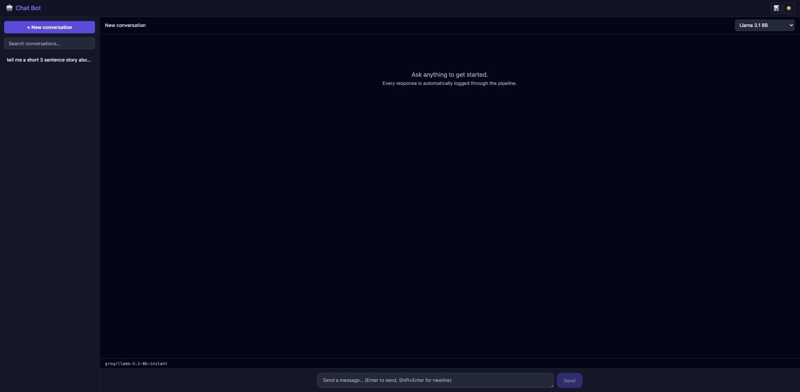
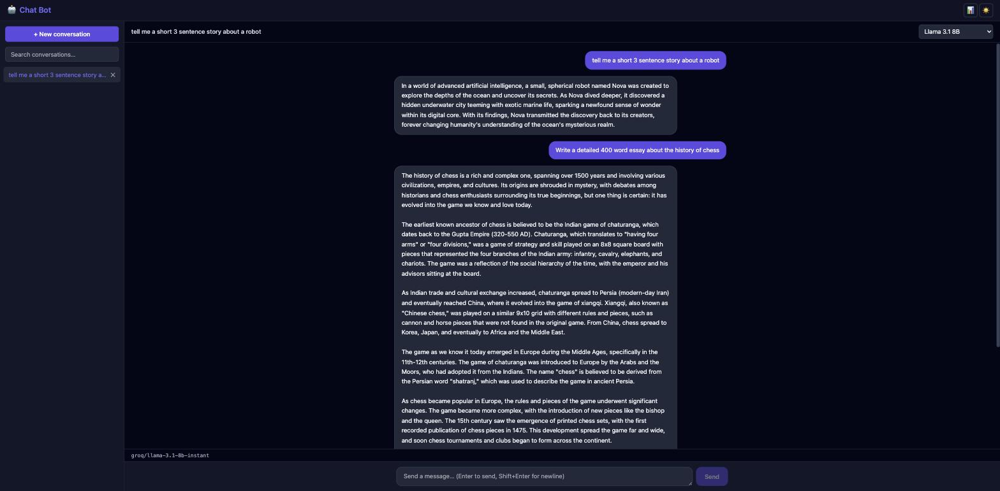
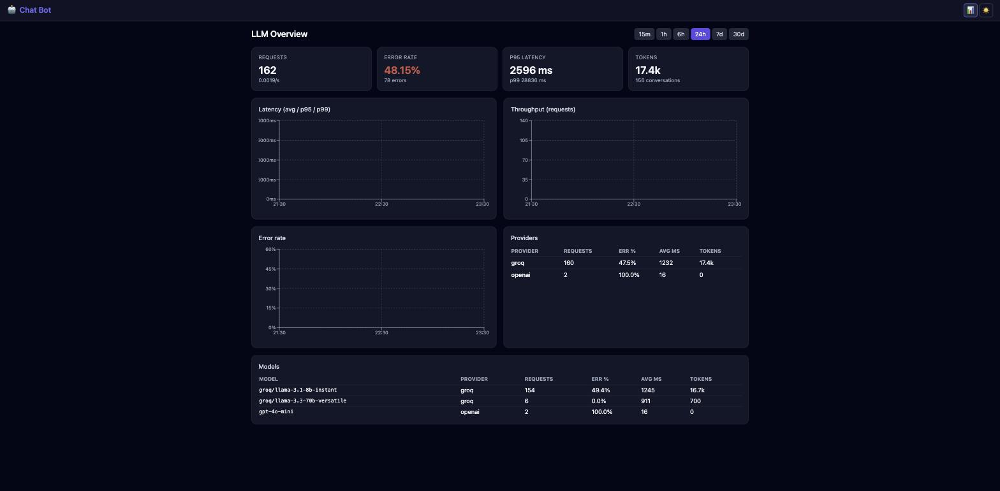
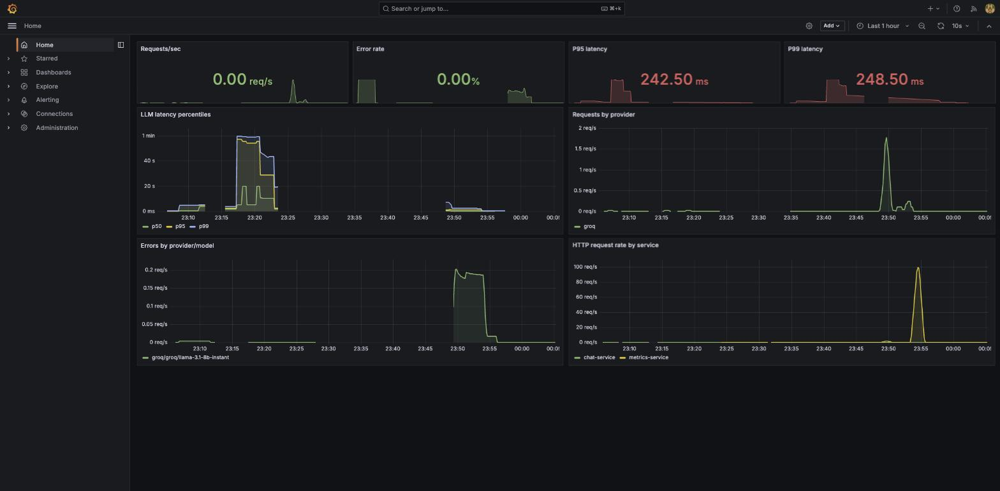
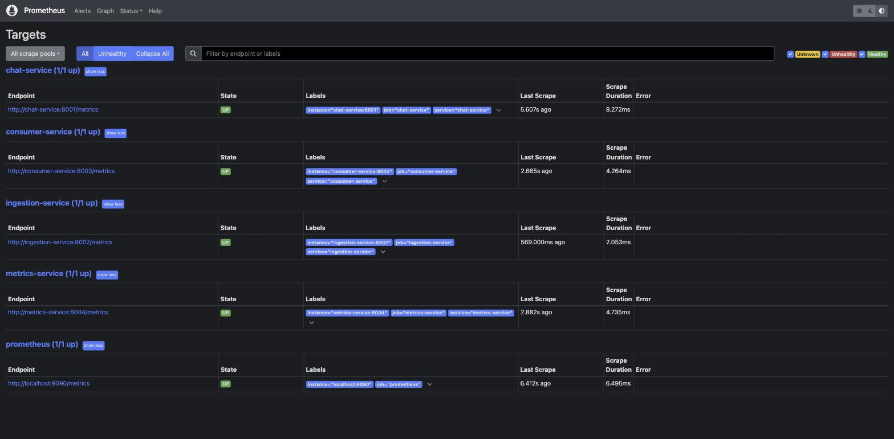
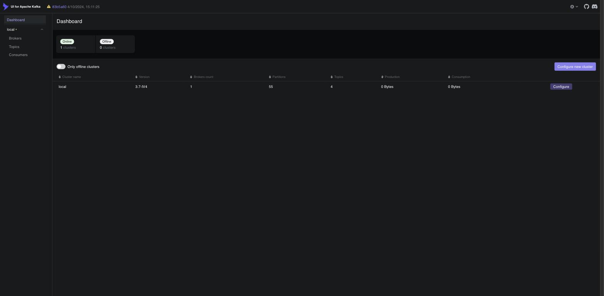

# Platform Walkthrough

A screen-by-screen tour of the running stack, plus a recap of the
architecture. For the deep architectural dive see
[ARCHITECTURE.md](ARCHITECTURE.md); for load-testing methodology and results
(including the Kubernetes autoscaling demo) see
[LOAD_TESTING.md](LOAD_TESTING.md).

## Architecture recap

```
                          Internet
                             │
                       NGINX Ingress
                             │
                     React Frontend (Vite)
                             │
              REST + SSE ┌───┴────────────┐ REST
                         ▼                 ▼
                   Chat Service      Metrics Service ──► PostgreSQL (reads)
                         │
                     LiteLLM (OpenAI / Anthropic / Groq / Gemini …)
                         │
                @observe_llm SDK  ──► Kafka: inference.logs
                                            │
                                    Ingestion Service
                                    (validate · redact PII · normalize)
                                            │
                                     Kafka: processed.logs
                                            │
                                    Consumer Service
                                    (batch insert · retry/backoff · DLQ)
                                            │
                                        PostgreSQL ◄── Grafana ◄── Prometheus
                                                        (scrapes every service)
```

The chat path (top) is the user-facing hot path — it never blocks on
logging. The telemetry pipeline (bottom) is fully decoupled over Kafka: if
Kafka, Ingestion, or Consumer fall behind or go down, chat keeps working —
the SDK buffers in memory and drops oldest events under sustained backlog
rather than exert backpressure on a user's request.

Two runtimes are used across this doc set:

| Runtime | Started by | Used for |
|---|---|---|
| Docker Compose | `python3 scripts/dev_up.py` | Day-to-day dev — full stack incl. Grafana/Prometheus/Kafka UI |
| local `kind` cluster | `infra/k8s/` manifests | Proving the Kubernetes HPA actually scales chat-service under load |

---

## Chat UI

The primary surface — branded as **🤖 Chat Bot** (deliberately generic;
the "LLM Observability" name is now confined to internal docs/dashboards,
not user-facing chrome). Empty state:



A live conversation, streamed token-by-token over SSE with a typewriter
reveal (see [LOAD_TESTING.md](LOAD_TESTING.md) for why the send button
stays disabled for the full reveal duration, not just the network duration):



- Model selector (top-right) switches between OpenAI/Anthropic/Groq/Gemini
  models — provider is resolved automatically from the model id
  (`apps/chat-service/app/services/providers.py`).
- Sidebar lists past conversations (search, delete, new-conversation).
- The 📊 icon in the header (not the wordmark) is the only way to reach the
  observability dashboard — intentionally de-emphasized so the app reads as
  a chat product first.

## Dashboard (`/dashboard`)

Read-only aggregation over `inference_logs`, served by `metrics-service`.
Shows request volume, error rate, P95/P99 latency, and per-provider/model
breakdowns over a selectable time window (15m–30d).



## Grafana — LLM Overview (`localhost:3001`, admin/admin)

The same telemetry as the in-app dashboard, but as a real-time Grafana
dashboard sourced from Prometheus rather than a direct SQL read — useful
for correlating request-rate/latency/error spikes against infrastructure
metrics (see the two panels below). Grafana's home page is configured to
open directly on this dashboard (`GF_DASHBOARDS_DEFAULT_HOME_DASHBOARD_PATH`
in `infra/docker/docker-compose.yml`) rather than Grafana's generic welcome
screen.



### Grafana — Container Resources

Per-container CPU% and memory, sourced from a small host-side exporter
(`infra/docker/docker_stats_exporter.py`) rather than cAdvisor — cAdvisor
can't reach the Docker daemon from inside a container on Docker Desktop for
Mac, since the daemon lives in Docker Desktop's own hidden VM. See
[LOAD_TESTING.md](LOAD_TESTING.md) for how this panel caught chat-service
pegging a full CPU core under load.


### Grafana — Kubernetes Autoscaling

Graphs the chat-service HPA's current/desired replica count, sourced from
`kube-state-metrics` running in a local `kind` cluster (bridged into
Prometheus via the `kind` Docker network — see
[LOAD_TESTING.md](LOAD_TESTING.md)).


## Prometheus (`localhost:9090`)

Prometheus's own UI is a query console, not a dashboard — there's no
"home dashboard" concept to configure the way Grafana has one. It's used
here purely as a debugging tool (checking target health, ad-hoc PromQL)
rather than something end users would look at; Grafana is the actual
dashboarding layer.



## Kafka UI (`localhost:8080`)

Cluster/topic browser for the `inference.logs` → `processed.logs` →
`dead-letter` pipeline.



---

## Running it

```bash
python3 scripts/dev_up.py            # build + start the Compose stack, wait for health
python3 scripts/dev_up.py --logs     # ...and follow logs
python3 scripts/dev_up.py --down     # tear down
```

| Surface | URL |
|---|---|
| Chat UI | http://localhost:3000 |
| Dashboard | http://localhost:3000/dashboard |
| Chat API docs | http://localhost:8001/docs |
| Metrics API docs | http://localhost:8004/docs |
| Grafana | http://localhost:3001 (admin/admin) |
| Prometheus | http://localhost:9090 |
| Kafka UI | http://localhost:8080 |
